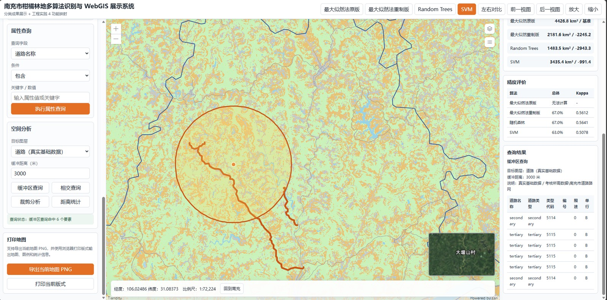

# 面向南充市特色农业资源管理的柑橘林空间分布识别与 WebGIS 可视化平台

> Citrus Forest Spatial Distribution Identification & WebGIS Visualization Platform for Nanchong's Specialty Agricultural Resource Management

基于 **ArcGIS JS API 4.18** 构建的柑橘林地遥感识别结果可视化平台，围绕「多算法分类成果展示」与「工程实践 GIS 功能」两条主线，完整覆盖 WebGIS 开发的核心能力：地图服务集成、矢量数据渲染、空间查询、空间分析、专题制图与结果统计。



| 技术栈 | 说明 |
| --- | --- |
| ArcGIS JS API | 4.18（AMD 模块化加载） |
| 底图 | 天地图（矢量 / 影像 / 地形） |
| 分类成果服务 | ArcGIS Server REST（MapImageLayer） |
| DEM 服务 | ArcGIS Server REST（坡度栅格） |
| 基础矢量 | GeoJSON（行政区划 / 柑橘斑块 / 道路 / 水系） |

---

## 项目简介

系统以南充市为研究区，集成四种遥感分类算法（最大似然法原版、最大似然法重制版、Random Trees、SVM）的分类成果服务，提供统一的图例、面积统计与精度评价（Kappa 系数），并支持任意两种算法结果的左右对比。同时实现了一套完整的前端 GIS 工具箱：多模式渲染、点/矩形/圆/多边形查询、属性查询、缓冲区/相交/裁剪/距离统计等空间分析，以及地图打印输出。

## 核心功能

**分类成果展示**
- 四分类 / 仅柑橘 两种结果模式切换，像元值语义自动映射
- 四算法一键切换 + 左右对比（同步视口联动）
- 统一图例、面积统计、精度评价（总体精度 / Kappa）

**图层与渲染**
- 矢量图层：行政区划、柑橘斑块、道路、水系
- 三种渲染模式：单值、唯一值、分级（classBreaks）渲染
- 属性标注、图层透明度实时调节
- DEM 坡度栅格服务图层

**查询与分析**
- 点击查询、矩形 / 圆 / 多边形范围查询
- 属性查询：包含、等于、前缀匹配、大于、小于
- 空间分析：缓冲区查询、相交查询、裁剪分析、距离统计
- 交互式点 / 线 / 面绘制

**地图交互**
- 鹰眼图（overview map）、坐标栏、比例尺
- 地图打印（导出 PNG / 打印版式）
- 底图切换（天地图矢量 / 影像 / 地形）

## 技术栈

- **前端框架**：原生 JavaScript（ES5 风格 + 模块化 IIFE），无构建依赖
- **地图引擎**：ArcGIS JS API 4.18
- **数据源**：ArcGIS Server REST 服务、GeoJSON、天地图瓦片
- **样式**：自定义 CSS（响应式三栏布局）

## 系统架构

采用「配置驱动 + 数据驱动」的分层设计，业务逻辑与数据定义解耦：

```
┌─────────────────────────────────────────────────┐
│                 应用层  app.js                    │
│   地图初始化 / 图层管理 / 查询分析 / 结果渲染      │
├─────────────────────────────────────────────────┤
│                 配置层                            │
│   service-config.js  服务地址与 Token 覆盖        │
│   config.js          算法服务 / 底图 / 空间参数   │
│   assessment-data.js 矢量与 DEM 图层定义          │
│   demo-data.js       演示数据 / 统计 / 精度       │
├─────────────────────────────────────────────────┤
│                 数据源                            │
│   天地图瓦片  ·  ArcGIS MapServer  ·  GeoJSON     │
└─────────────────────────────────────────────────┘
```

- `service-config.js` 可在部署时覆盖默认服务地址与天地图 Token，无需改动业务代码。
- `assessment-data.js` 以声明式方式描述每个图层的字段、标注字段与渲染预设，`app.js` 统一解析，实现「一套渲染引擎，多图层复用」。

## 目录结构

```
webgis-南充柑橘/
├── web/
│   ├── index.html                # 系统入口页
│   ├── css/style.css             # 样式（三栏布局 + 响应式）
│   ├── js/
│   │   ├── app.js                # 核心逻辑（地图、图层、查询、分析）
│   │   ├── config.js             # 全局配置（算法服务 / 底图 / 参数）
│   │   └── service-config.js     # 服务地址与 Token 覆盖
│   ├── data/
│   │   ├── assessment-data.js    # 矢量 / DEM 图层声明式配置
│   │   ├── demo-data.js          # 演示数据与统计精度
│   │   └── vector/               # GeoJSON 矢量数据
│   │       ├── admin-boundary.geojson
│   │       ├── citrus-parcels.geojson
│   │       ├── rivers.geojson
│   │       └── roads.geojson
│   ├── scripts/
│   │   └── build-vector-geojson.js # 矢量数据构建脚本
│   └── tests/
│       └── static-checks.js       # 静态校验脚本
├── docs/
│   └── images/                   # README 用截图
├── .github/
│   └── workflows/                # GitHub Pages 自动部署
└── README.md
```

## 快速开始

本项目为纯前端静态应用，无需构建工具。由于分类成果与 DEM 依赖本地 ArcGIS Server，完整数据需在本地启动服务；基础矢量与演示数据为内置离线数据，可直接运行查看界面与交互。

1. 克隆仓库：

   ```bash
   git clone git@github.com:edjsh175/nanchong-citrus-webgis.git
   ```

2. 启动本地静态服务器（`web/` 为站点根目录）：

   ```bash
   cd nanchong-citrus-webgis/web
   python -m http.server 8080
   ```

3. 浏览器打开 `http://localhost:8080/index.html`

> **在线预览**：本项目已启用 GitHub Pages，访问 <https://edjsh175.github.io/nanchong-citrus-webgis/> 可直接查看在线演示（分类成果与 DEM 服务需本地 ArcGIS Server，未启动时自动降级为内置演示数据）。

> **说明**：分类成果服务与 DEM 服务默认指向 `https://localhost:6443/arcgis/...`（本地 ArcGIS Server）。未启动服务时，系统自动降级为内置演示数据，矢量图层、查询与分析功能仍可完整演示。服务地址与天地图 Token 可在 `web/js/service-config.js` 中修改（仓库内的 Token 已置空，部署时需自行填写）。

## 技能亮点（GIS 开发能力）

- **服务端 GIS 集成**：ArcGIS Server REST 服务的接入与子图层管理，天地图第三方底图与注记叠加
- **空间数据渲染**：实现单值 / 唯一值 / 分级（classBreaks）三类专题渲染引擎，GeoJSON → Feature 几何转换与符号化
- **空间查询与分析**：基于 GeometryEngine 的范围查询、缓冲区、相交、裁剪与距离统计
- **坐标系与投影**：Web 墨卡托与经纬度转换、坐标栏与比例尺联动
- **工程化**：配置驱动分层架构、声明式图层定义、静态校验脚本、可覆盖部署配置

## 数据说明

- 行政区划、柑橘斑块、道路、水系为南充市真实基础 / 专题数据（Shapefile 转换而来）
- 分类成果为四种算法的真实分类服务，精度统计来自 2026-06 的实测分类报告

## License

MIT
